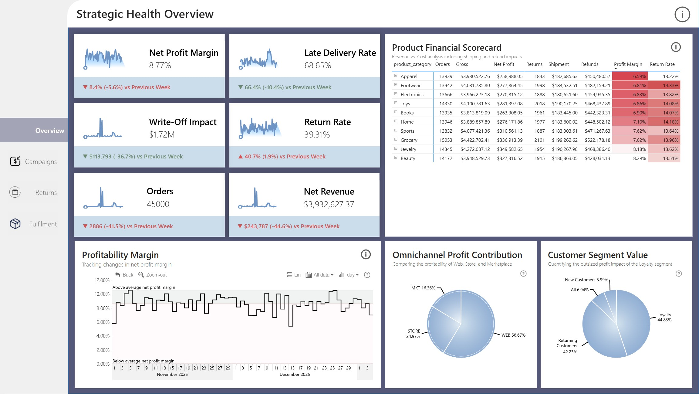
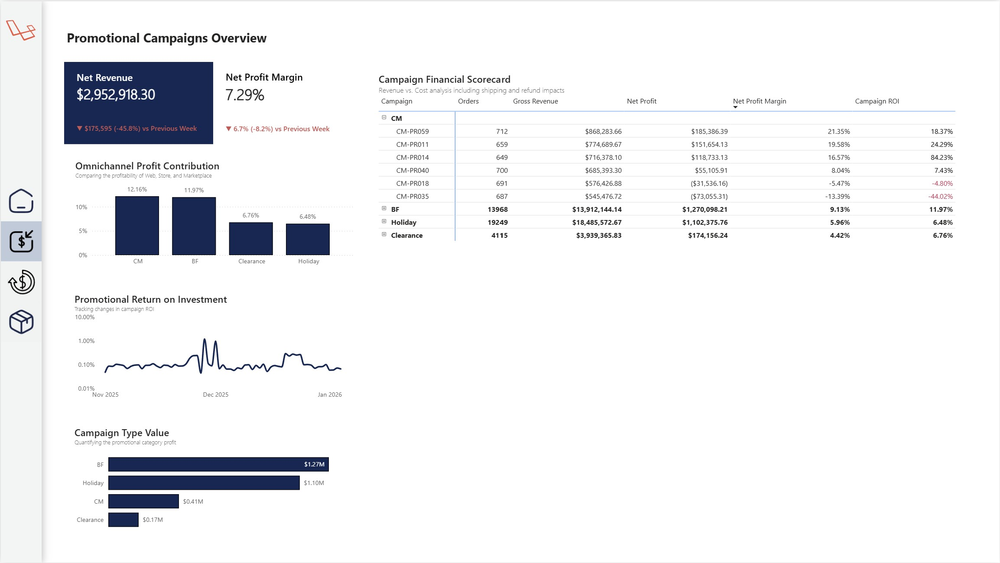
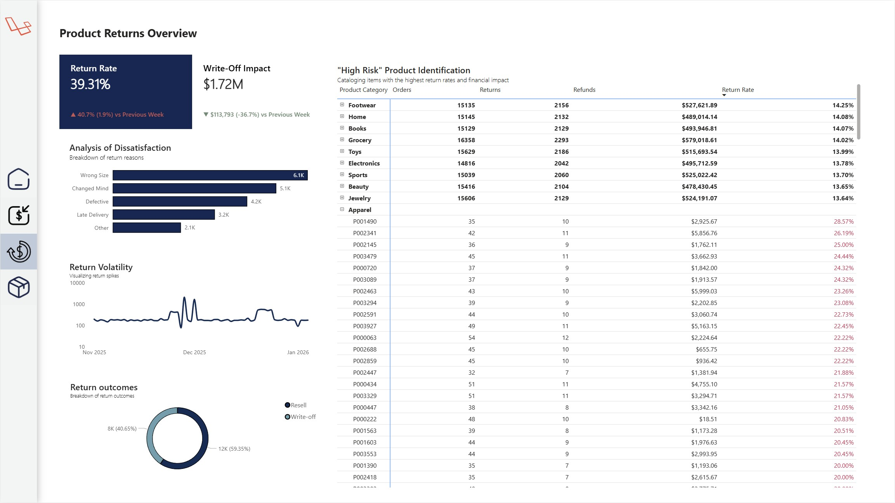
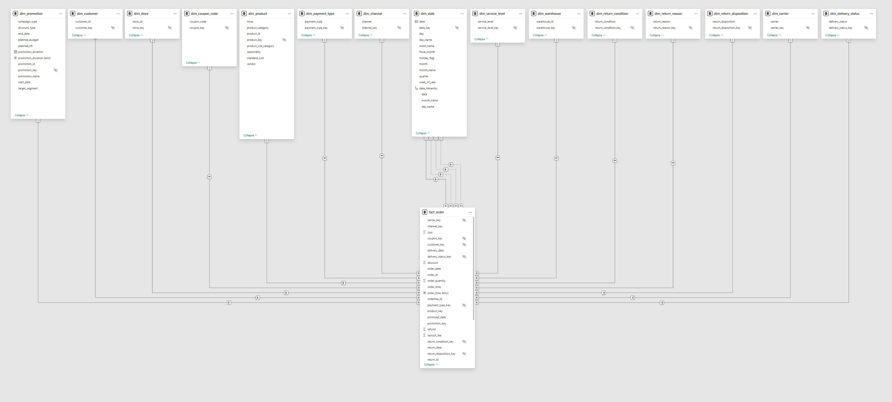

## Executive Summary
The holiday season is busy, competitive, and full of rapid decision making. This dataset gives you a chance to understand how different parts of the business worked during this peak time.Evaluate which holiday campaigns created the most profitable sales uplift. Explore delivery performance to see which carriers and shipping methods met their promised dates. Understand what caused returns and how they affected overall revenue. Support future planning by highlighting what worked well and what should be improved for next year.

[View Dashboard](https://app.powerbi.com/view?r=eyJrIjoiMWJlMTMwMTUtNmFlMy00ZmJjLWIwYzItYmU3OTIzMjM0NzEzIiwidCI6IjQ2NTRiNmYxLTBlNDctNDU3OS1hOGExLTAyZmU5ZDk0M2M3YiIsImMiOjl9)

## Table of Contents
- [Executive Summary](#executive-summary)
- [Key Insights From Data](#key-insights-from-data)
- [Dashboard Preview](#dashboard-preview)
- [Dataset Information](#dataset-information)
- [Credits](#credits)

## Key Insights From Data
The Holiday Performance and Reverse Logistics Audit evaluates the financial impact of fulfillment failures during the 2025 peak season. While major sales events like Black Friday achieved "Star" status with over $1.2M in net profit and 12% ROI, the broader holiday period suffered from significant profit erosion due to a 39.31% return rate and $1.72M in write-offs.

The audit identifies a systemic breakdown in the logistics network, where a 68.65% late delivery rate across all carriers was driven by a 1.3-day "Reality Gap" between promised and actual lead times. These delays directly contributed to high customer dissatisfaction, leading to a massive spike in return volatility that peaked in late November. Ultimately, with only 59% of returned goods suitable for resale, the data suggests that improving fulfillment accuracy is the primary lever for protecting future seasonal margins.

## Dashboard Preview
### Main dashboard overview page

### Campaigns Overview

### Returns Overview

### Fulfilment Overview

## Dataset Information
### Data Model

## Credits
Dataset is provided by [Zoomcharts](https://zoomcharts.com/en/microsoft-power-bi-custom-visuals/challenges/fp20-analytics-december-2025) as part of the december 2025 data analytics challenge.
